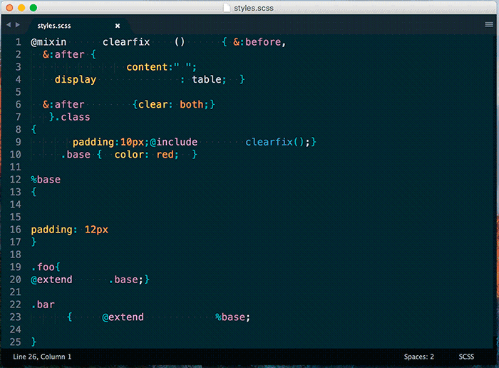

# CSSfmt for Sublime Text 3

## About

https://github.com/morishitter/cssfmt - ***"CSSfmt is a tool that automatically formats CSS source code, inspired by Gofmt, and built on top of the PostCSS ecosystem."***

## The Requirements

 - Node.js

## Installation
### Using Package Control

With [Package Control](https://packagecontrol.io/installation):

Run “Package Control: Install Package” command, find and install `CSSfmt` plugin.

### From the Source
Run the following command in your Sublime Text 3 packages directory:

```sh
$ git clone https://github.com/Redknife/sublime-cssfmt.git sublime-cssfmt
```

Depending on your OS (and Sublime Text version) the packages directories are:
 - Linux: `~/.config/sublime-text-3/packages`
 - OS X: `~/Library/Application\ Support/Sublime\ Text\ 3/Packages`
 - Windows: `%APPDATA%\Sublime Text 3\Packages`

## Plugin usage

Press <kbd>ctrl</kbd>+<kbd>shift</kbd>+<kbd>c</kbd> or open "Tools" menu and select "Run CSSfmt" or open the Command Palette and write "Run CSSfmt"

### In action

